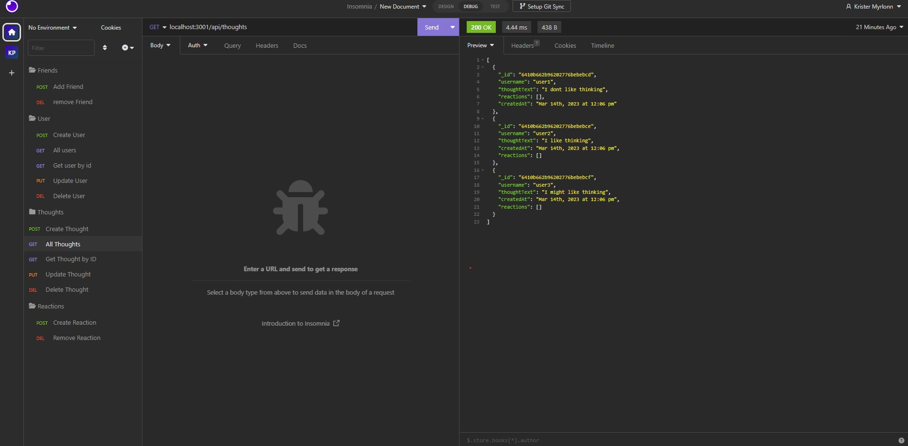

# Kristers Employee Tracker
      

  
  ## Description
This Social Network API shows some of my newly learned skills working with API routes, noSql database, mongoDB, Mongoose, controllers. I have learned an introduction in how you can build a database with noSql.
  
  ## Table of Contents
  * [Installation](#installation)
  * [Usage](#usage)
  * [Credits](#credits)
  * [License](#license)
  * [Contributing](#contributing)
  * [Questions](#questions)

  ## Installation
  Download and install folder, install node and run npm i, then node index.js in the integrated terminal. The application does have seeds, so you can run node utils/seed. 

  Github Repository: https://github.com/kristermyr/SocialNetwork
  Walkthrough video: https://www.youtube.com/watch?v=IPLa5i8ofU0&ab_channel=KristerMyrl%C3%B8nn

  ## Usage
  
  

  ## Dependencies
  Express and mongoose

  ## Credits
    Class activities
    14-Stu_CRUD-Mongoose
    22-Stu_Virtuals
    24-Stu_Subdoc-Population
    26-Stu_CRUD-Subdoc
    28-Stu_Mini-Project

  ## Collaborators
  * Dylan Quaale - https://github.com/dylanquaale/Social_Network

  ## License
  MIT

  ## Contributing
  Create a new branch and submit a pull request

  ## Questions
  Github Username: kristermyr
  Please send me an E-mail if you have any questions [here](mailto:krister90@gmail.com) or visit https://github.com/kristermyr

